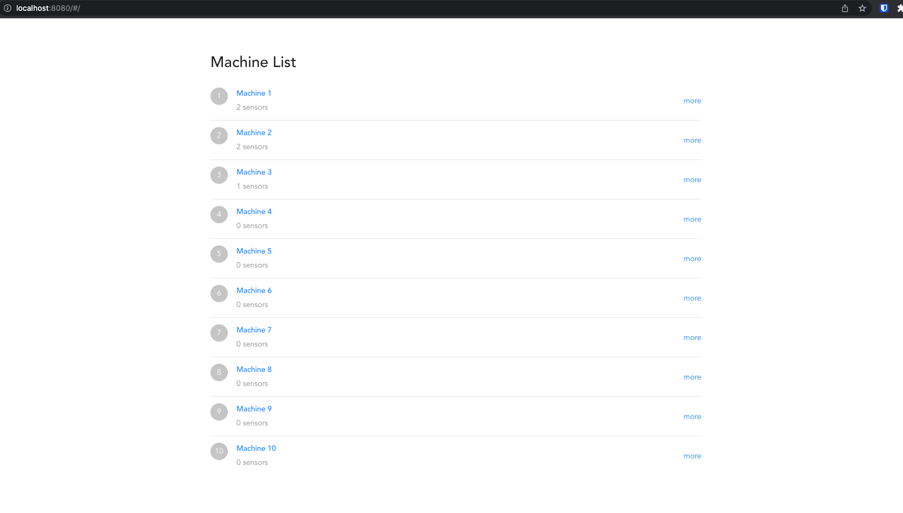
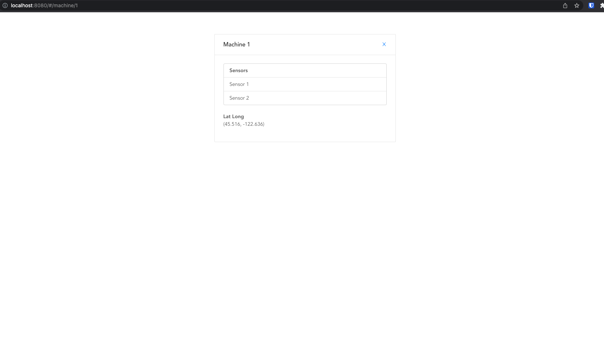
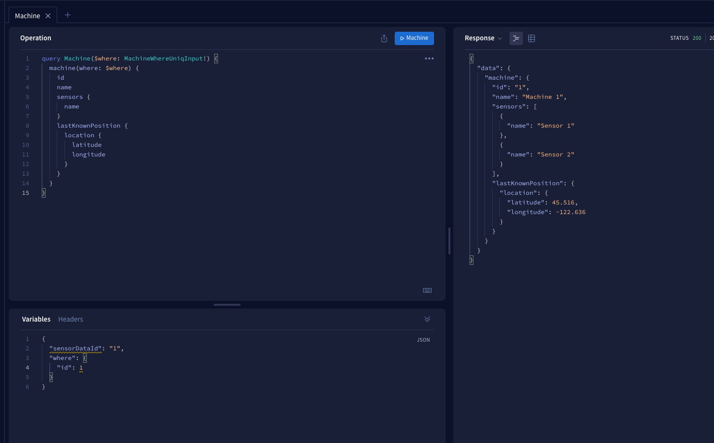

# Machine Tracker

Run backend and frontend server and then navigate to `localhost:8080`

## Running the Apollo Server

```shell
npm start
```

## Running the Vue App

```shell
  npm run serve
```

## Project Screenshots






